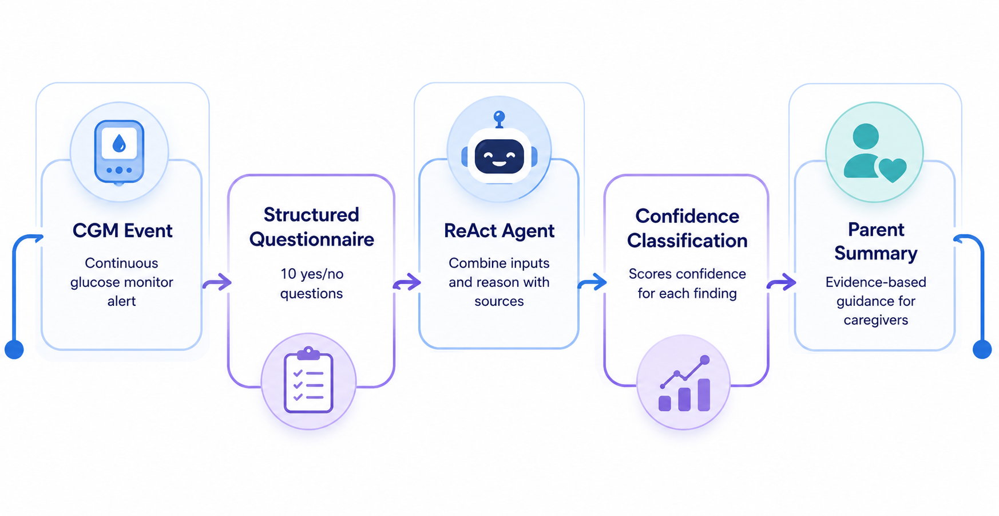

# SugarBuddy — Architecture

This document describes how SugarBuddy is put together: the reasoning pipeline, the
supporting modules around it, how state is carried across a multi-turn conversation, and
how the system is deployed.

## Overview

SugarBuddy is a Parent-Teen Diabetes Investigation Agent. A teen's continuous glucose
monitor (CGM) produces an anomaly (a dangerous spike, drop, sensor gap, etc.); the agent
turns that raw event into a short, evidence-based conversation that ends in a plain-language
summary for a parent — a recap of what happened, up to three possible contributing causes
each labeled with a confidence level, and one practical suggestion.

## Pipeline



```
CGM Event -> Structured Questionnaire (10 yes/no) -> ReAct Agent (bounded 0-or-1 follow-up)
          -> Confidence Classification -> Parent Summary
```

| Stage | Module | What it does |
|---|---|---|
| CGM Event | `agent_pipeline.parse_cgm_event` | Extracts a structured anomaly (`type`, `severity`, `direction`, `message`, `details`) from the user's free-text or JSON description, via an LLM call. |
| Structured Questionnaire | `questionnaire.py` | Ten fixed yes/no questions (Hebrew), asked deterministically — no LLM call. Answers come back as a numbered list and are parsed with a regex. |
| Context Retrieval | `retrieval.py` | Given the anomaly's direction and the questionnaire answers, retrieves candidate-cause table rows and reference-text snippets, either via Pinecone similarity search or a keyword-matching fallback. |
| ReAct Agent | `agent_pipeline.run_react_agent` | Reasons over the anomaly, answers, and retrieved context. May ask **one** adaptive follow-up question if the retrieved context doesn't clearly explain the event; otherwise returns up to three candidate findings, each citing its source (`table`, `reference`, or `answers`). |
| Confidence Classification | `agent_pipeline.run_confidence_classification` | Scores each candidate finding as `low`/`medium`/`high` confidence with a one-sentence rationale. |
| Parent Summary | `agent_pipeline.run_parent_summary` | Merges everything into a single Hebrew-language summary: a short recap, up to three distinct possible reasons ordered by confidence, and one practical suggestion. |

Every stage except the questionnaire makes one LLM call and contributes one entry to the
`steps` array returned by the API, so the full reasoning trace (system prompt, user prompt,
and response) is inspectable for every turn.

## Conversation state

The API is stateless — there is no server-side session store. State instead round-trips
through the client inside the agent's own response text, as a base64-encoded JSON marker
(`conversation_state.py`):

1. **Turn 1** — the teen describes the event. The agent parses it, asks the ten questions,
   and appends a marker carrying the parsed anomaly.
2. **Turn 2** — the client resends the *entire* conversation so far (marker included) plus
   the teen's answers. `extract_conversation_state` reads the marker back out, so the agent
   knows it's mid-questionnaire without any external memory. From here the agent either asks
   one follow-up question (embedding an updated marker) or finalizes.
3. **Turn 3** (only if a follow-up was asked) — same pattern, now carrying the follow-up
   answer, which forces the ReAct Agent to finalize instead of asking again.

This keeps the deployment trivial (any serverless invocation can serve any turn) at the cost
of trusting the client to echo the marker back unmodified; `agent_pipeline.py` re-validates
the anomaly it carries before using it, so a malformed or tampered marker fails cleanly
instead of raising an unhandled error deeper in the pipeline.

## Retrieval

`retrieval.py` supports two backends behind the same interface:

- **Pinecone** (`retrieve_context_pinecone`) — embeds the query with the same LLM provider
  used for chat, then does a similarity search against two namespaces: `causes` (the
  candidate-cause table, `data/investigation_table.json`) and `reference` (medical reference
  text chunks from the American Diabetes Association and NIDDK, `data/rag/*.txt`). Populated
  once via `pinecone_ingest.py`.
- **Keyword fallback** (`retrieve_context_keyword`) — used automatically whenever Pinecone
  isn't configured or a query fails, matching questionnaire answers against a small keyword
  map instead of embeddings.

`agent_pipeline._retrieve_context` picks whichever backend is available at request time, so
the rest of the pipeline is indifferent to which one actually ran.

## Anomaly detection (standalone)

`sugarbuddy_anomaly_detector.py` is a separate, self-contained module that watches a live
Nightscout feed and flags three classes of anomaly: sustained rate-of-change, sensor gaps,
and insulin-on-board-contextual risk (plus a simple raw glucose-extreme check). It includes
its own `CaseTracker` so an ongoing anomaly doesn't re-trigger the pipeline every few
minutes.

This module is decoupled from the graded API surface on purpose: `/api/execute` treats "CGM
Event" as text in the prompt, not something it fetches live, since a serverless deployment
has no persistent process to poll with. Wiring `AnomalyDetector` into a scheduler that calls
`/api/execute` automatically is future work, not yet implemented.

## API and GUI

`api/index.py` is a single FastAPI app exposing:

- `GET /api/team_info` — static team metadata.
- `GET /api/agent_info` — a description of the agent, its capabilities/constraints, and two
  worked examples of a full conversation.
- `GET /api/model_architecture` — serves `docs/architecture/pipeline_diagram.png`.
- `POST /api/execute` — `{"prompt": "..."}` in, `{"status", "error", "response", "steps"}` out.
  Runs `agent_pipeline.run_pipeline`, then logs the call (non-blocking — failures never
  propagate to the caller) via `supabase_log.log_execution`.
- `GET /` — serves `static/index.html`, a single self-contained HTML/CSS/JS page that drives
  the multi-turn conversation and displays each step's prompt/response trace.

The whole app deploys as one Vercel serverless function (`vercel.json`), and
`.github/workflows/deploy.yml` deploys it on every push to `main`.

## Logging

Every successful `/api/execute` call writes one row to Supabase's `execution_log` table:
the raw prompt/response, the full `steps` trace, and one column per pipeline field (parsed
anomaly, questionnaire answers, retrieved context, ReAct findings, confidence result, parent
summary, follow-up question/answer) so any stage's output is directly queryable without
re-parsing nested JSON. Logging failures are swallowed — this is an audit trail, not part of
the pipeline's contract with the caller.

## Testing

`tests/` is a pytest suite covering every module; every LLM, Pinecone, and Supabase call is
mocked, so the suite runs offline and at no cost. `local_prototype.py` is a separate,
manual smoke test that makes real calls end-to-end for interactive verification.

## Tech stack

Python 3.13 · FastAPI · pytest · OpenAI-compatible LLM client (LLMod.ai) · Pinecone · Supabase
(Postgres + PostgREST) · Vercel (deployment) · GitHub Actions (CI/CD).
